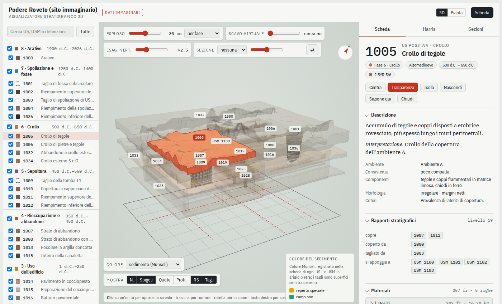

# Stratigrafia 3D

Ricostruzione 3D delle unità stratigrafiche (US) a partire dalla documentazione di scavo 2D:
poligoni in pianta, quote, profili di sezione (GIS o CAD) e schede (Excel, CSV o database).
Funziona senza internet, come app sul proprio computer o dalla riga di comando.

*[Read in English](README.md)*



## App su Windows

**App pronta.** Scarica lo zip più recente da
[Releases](https://github.com/MoJoDoD/3Dstratigraphy-app-development/releases), estrailo e avvia
`Stratigrafia3D.exe`: non serve Python.

**Dal codice sorgente:**

1. Installa Python 3.12 da python.org (spunta "Add python.exe to PATH").
2. Doppio clic su **Installa (Windows).bat** (solo la prima volta, qualche minuto).
3. Doppio clic su **Avvia Stratigrafia 3D.bat**. Si può trascinare un file `.scavo` sull'icona per aprirlo.

L'app funziona senza internet: gira sul tuo PC e usa una finestra propria (o il browser, se la
finestra non è disponibile). L'interfaccia è in italiano e in inglese.

## Import flessibile

L'app e il comando `strat3d importa` accettano file "come arrivano": GeoPackage, shapefile, GeoJSON,
DXF da stazione totale (polilinee chiuse per layer `US_1005`, punti 3D, testi come etichette o quote),
CSV di punti, Excel o CSV delle schede. Riconoscono da soli:
- il ruolo di ogni layer (limiti US, murature, quote, profili, limite di scavo…) da nome e geometria;
- il campo con il numero di US (anche scritto "US 1005") confrontandolo con le schede;
- la quota dalla Z o da un campo, e il tipo di quota da un campo o dal nome del file;
- i rapporti in un foglio a sé o nelle colonne della scheda ("Copre", "Tagliato da"…);
- US negative dalla parola "taglio", spessori in centimetri, USM nello stesso foglio delle US;
- archivi in inglese: context register (Context, Type, Thickness…), rapporti "fills", "covers",
  "cut by"…, livelli "top/bottom/cut/rim", fogli Phases, Finds, Samples, Documentation.

## Ricette di importazione

Una **ricetta** raccoglie tutte le scelte dell'importazione e si salva in un file `.json`, da riusare
per un altro scavo dello stesso tipo o da condividere. Oltre a quale layer e quale colonna usare, dice
come trasformare i dati:

- **tabelle collegate**: più CSV o fogli insieme (un archivio relazionale esportato), con materiali,
  campioni, fasi e documentazione agganciati al numero dell'unità;
- **vocabolari**: come leggere i valori dell'archivio («Cut» = negativa, «fills» = riempie…);
- **rapporti** da un foglio, da colonne («Copre», «Tagliato da»), da una colonna di testo
  («copre 12, 15; taglia 20», anche il formato di pyArchInit) o da una colonna «padre» («Fill of»);
- **unità di misura** di spessori e profondità, **valori nulli** (-9999, -99,99…);
- **filtri**: un sito, un settore, un tipo di elemento di un archivio più grande;
- **poligoni ereditati**: i riempimenti senza pianta propria usano il poligono del taglio;
- **campi dai poligoni**: valori della scheda presi dagli attributi del layer (es. la profondità);
- **quote dai vertici 3D** di poligoni rilevati con la stazione totale.

Ricette pronte: **Framework Archaeology** (archivi di Stansted e Heathrow T5 così come si scaricano) e
**pyArchInit** (database SpatiaLite, provata sul database di esempio distribuito con il plugin). Si leggono anche archivi `.zip`, database SpatiaLite, CSV con geometrie in WKT e CSV in codifica
Windows; per Access l'app indica come esportare le tabelle in CSV.

## Ricostruzione adattiva

Le quote non sono obbligatorie. Ogni unità viene ricostruita con quello che c'è, e la strategia
usata resta scritta nel progetto (nel visualizzatore: Colore → affidabilità):

| Dati dell'unità | Ricostruzione | Strategia |
| --- | --- | --- |
| quote o profili | kriging del tetto e dello spessore | misurata |
| taglio con profondità in scheda | superficie di riferimento meno la profondità; pareti dalle linee di fondo, se ci sono | profondita |
| riempimento o strato con spessore | sotto la superficie o l'orlo del taglio, nell'ordine della sequenza | impilata |
| profondità o spessore mancanti | valori tipici (0,20 m per i tagli, 0,10 m per gli strati) | schematica |

La **superficie di riferimento** può essere un modello del terreno (GeoTIFF), una quota costante o
l'interpolazione delle quote rilevate, abbassata se serve (per esempio dell'arativo asportato). Il
modello del terreno viene copiato nel `.scavo`. Quando i rapporti non dicono l'ordine dei riempimenti
di un taglio, lo si deduce dal tipo (primario in basso) e dal numero; se gli spessori registrati
superano la profondità, si riducono in proporzione. Tutto viene segnalato nella verifica.

La **verifica** (pulsante Verifica, o l'ultimo passo dell'importazione) permette correzioni in blocco:
cambiare la profondità e lo spessore tipici, usare la mediana delle unità dello stesso tipo
(«Posthole», «Pit»…) registrate nello scavo, dare una quota costante alla superficie, oppure escludere
dal 3D un gruppo di unità. Le unità escluse restano nelle schede e si reincludono con un clic.

## Modifiche e file d'origine

Nell'app, la scheda di ogni unità ha il pulsante **Modifica**: si cambiano i campi (tipo, definizione,
fase, descrizione, spessori, datazione e gli altri campi dell'archivio) e i rapporti. Un rapporto
che creerebbe un ciclo nella sequenza viene rifiutato. Se la modifica cambia la forma di un'unità,
l'app propone di ricostruire solo quella e le unità che vi stanno sopra.

Le modifiche restano nel progetto finché non si sceglie **Scrivi nei file**. La scrittura usa la
ricetta al contrario: colonna d'origine, vocabolario (negativa → «Cut»), unità di misura e forma dei
rapporti (foglio a parte, colonne come «Copre» o «Fill of», testo di pyArchInit). Si possono scrivere:
- file Excel, conservando formattazione e formule (le celle con una formula non si toccano);
- file CSV, con la stessa codifica e lo stesso separatore;
- tabelle di GeoPackage e di SQLite/SpatiaLite.

Prima di scrivere, una copia di ogni file va in `~/.stratigrafia3d/copie`.

Il verso opposto funziona allo stesso modo. Quando i file d'origine cambiano (per esempio l'Excel
aggiornato in cantiere), all'apertura del progetto l'app propone **Aggiorna dai file**: rilegge tutto
con la stessa ricetta e ricostruisce solo le unità toccate. Dalla riga di comando:
`strat3d riscrivi progetto.scavo` e `strat3d aggiorna progetto.scavo`.

## Foto, disegni, ortofoto e modelli 3D

- **Documentazione.** Se il foglio della documentazione ha una colonna con il file (per esempio
  `photographs/9248.jpg`), l'app trova le immagini accanto al file delle schede o, per nome, nelle
  sue sottocartelle. Nella scheda di ogni unità compaiono le miniature; un clic apre l'immagine
  grande, e le frecce passano alle altre. TIFF e immagini pesanti vengono ridotti al volo; i PDF e gli
  altri file si aprono con il programma del computer.
- **Ortofoto.** Un GeoTIFF a colori (anche compresso JPEG) aggiunto tra i file viene riconosciuto da
  solo. Si ritaglia sull'area dello scavo e si conserva nel progetto. Nel visualizzatore, con
  Colore → ortofoto, è proiettata dall'alto sulle unità.
- **Modelli 3D rilevati.** OBJ (con colori o texture dal file .mtl) e PLY (ASCII o binario) nelle
  coordinate del GIS; uno spostamento si indica nel wizard. Sopra i 300 000 triangoli il modello
  viene semplificato. Si accende e si spegne con «Rilievo 3D», e diventa trasparente quando si
  sceglie un'unità.

## Esportazioni

Dal menu **Esporta** (o con `strat3d elaborati`):

| Elaborato | Formato | Contenuto |
| --- | --- | --- |
| Modello 3D | `.glb` | Un oggetto per unità con la sua scheda, raggruppati per fase; ortofoto e rilievi 3D se ci sono. Si apre in Blender e MeshLab |
| Pagina web | `.html` | Il visualizzatore completo in un solo file, da aprire senza internet o da condividere |
| Tabella dei volumi | `.xlsx` | Area, volume, quote, spessore e affidabilità di ogni unità, più i totali per fase |
| Piante per fase | `.svg` | Un riquadro per fase, scala 1:200, con il limite di scavo e i numeri |
| Pianta | `.dxf` | Poligoni in coordinate reali, un layer per fase, per CAD e GIS |
| Sezioni dal modello | `.svg`, `.dxf` | Il modello tagliato lungo le tracce delle sezioni del GIS (o due sezioni centrali), scala 1:50 |

Le sezioni sono calcolate tagliando le mesh chiuse delle unità: servono come base per il disegno
e per confrontare il modello con le sezioni rilevate.

## Visualizzatore

- **Colore**: sedimento, fase, categoria, affidabilità, oppure qualsiasi campo a categorie della scheda
  (per Stansted: Feature type, Side shape, Excavation stage…), con legenda e conteggi.
- **Harris**: ogni gruppo di unità collegate (una buca con i suoi riempimenti, un settore) è
  impaginato a parte. Oltre 150 unità il pannello mostra la sequenza dell'unità selezionata, e a
  richiesta tutto il diagramma. L'ordine dei riempimenti dedotto dal programma è tratteggiato a
  puntini, e nella scheda compare come «copre (dedotto)».

Aree grandi (oltre 65 m) e centinaia di unità sono gestite; `strumenti/caso_studio_stansted.py`
ricava un caso studio in inglese dall'archivio aperto di Framework Archaeology (Stansted): senza
quote, con profondità, spessori e un modello del terreno.

Ogni scelta è modificabile e si salva come profilo riutilizzabile per lo stesso cantiere.

## Installazione

```
pip install -e .[demo,test]
```

## Uso dalla riga di comando

```
strat3d app                                        # apre l'applicazione
strat3d importa rilievo.dxf schede.xlsx -o scavo.scavo   # import automatico senza interfaccia
strat3d demo cartella_demo                         # genera lo scavo dimostrativo "Podere Roveto"
strat3d verifica scavo.gpkg schede.xlsx            # controlla dati e rapporti stratigrafici
strat3d crea-progetto scavo.gpkg schede.xlsx -o scavo.scavo
strat3d info scavo.scavo
strat3d ricostruisci scavo.scavo --unita 1016      # ricalcola 1016 e le unità che le stanno sopra
strat3d visualizzatore scavo.scavo -o web/index.html
strat3d esporta-glb scavo.scavo -o scavo.glb --esploso 0.3   # si apre in Blender
```

## Uso da Python

```python
from stratigrafia3d import Scavo, ricostruisci, esporta
s = Scavo.da_sorgenti("scavo.gpkg", "schede.xlsx")
for p in s.verifica():
    print(p)
ricostruisci(s)
s.salva("scavo.scavo")
esporta.visualizzatore(s, "index.html")
```

## Dati in ingresso

**GeoPackage** (nomi in `schema.py`):
- `us_poligoni` (campo `us`) e `usm_poligoni` (campo `usm`)
- `quote` (PointZ, campi `us`, `tipo_quota`: sup, inf, taglio, orlo, rasatura, fondazione)
- facoltativi: `profili_us` (LineStringZ, campi `sezione`, `us`, `interfaccia`: sup, inf, taglio),
  `area_scavo`, `sezioni`, `sezioni_disegno`, `reperti_speciali`, `campioni`

**Excel**: fogli `US` e `Rapporti` obbligatori; `USM`, `Fasi`, `Materiali`, `Reperti_speciali`,
`Campioni`, `Documentazione` facoltativi. Nel foglio Rapporti sono accettate anche le forme inverse
(“coperto da”, “tagliato da”…).

## Il formato `.scavo`

È un GeoPackage: contiene i layer, i fogli Excel come tabelle `tab_<foglio>`, le geometrie ricostruite
(`s3d_modelli`), i parametri (`s3d_progetto`), l'impronta dei file di origine (`s3d_sorgenti`) e il
registro delle operazioni (`s3d_storico`). QGIS lo apre come GeoPackage (scegliendo "Tutti i file" o
rinominandolo in `.gpkg`).

## Metodo

Per ogni US positiva: triangolazione vincolata del poligono; tetto per trend planare + kriging dei
residui; spessore krigato attorno allo spessore medio (a zero sui bordi liberi delle lenti); base
agganciata al tetto delle unità coperte secondo i rapporti. I tagli sono superfici (orlo, fondo e
larghezza della parete stimata dai dati); le USM volumi tra rasatura e fondazione.
Ogni unità riporta quanto è misurata e quanto stimata (`qualita`).

Sullo scavo dimostrativo lo scarto mediano del tetto rispetto al modello di verità è sotto 3 cm per
il 90% delle unità (verificato da `tests/test_scavo_demo.py`).

## Test

```
pytest -q
```

## Sviluppo

A ogni caricamento su GitHub i test girano su Windows e Linux. Un tag `v*` (per esempio `v0.9.0`)
costruisce l'app per Windows e la pubblica tra le Releases.

## Licenza

GPL-3.0-or-later (vedi `LICENSE`). Dati dello scavo dimostrativo interamente immaginari.
Il pacchetto facoltativo `triangle` (Triangle di J. R. Shewchuk) è libero per la ricerca ma non per
usi commerciali: il programma funziona anche senza (usa scipy) e l'app per Windows non lo include.
Per citare il programma: [`CITATION.cff`](CITATION.cff).
