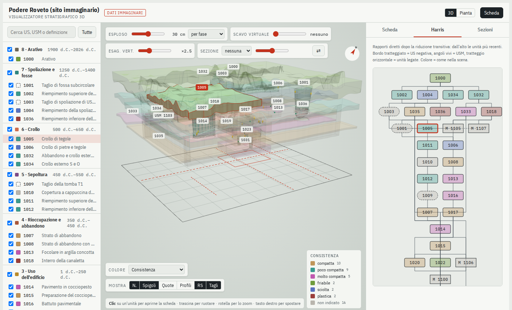
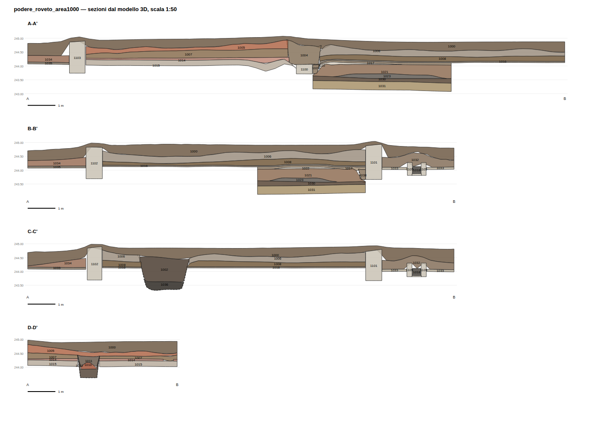

# Stratigrafia 3D

**3D reconstruction of archaeological stratigraphic units from ordinary 2D excavation records.**

Stratigrafia 3D turns what an excavation already produces into an interactive 3D model of its
stratigraphic units (contexts):
- plans of each unit, levels and section drawings, from a GIS or CAD;
- the context register and the stratigraphic relationships, from Excel, CSV or a database.

It runs offline on your own computer, as a desktop app or from the command line.

*[Leggi in italiano](README.it.md)*


## What it does

- **Imports archives as they come.** It reads:
  - GeoPackage, shapefile, GeoJSON, DXF from a total station, SpatiaLite and CSV with WKT geometries;
  - Excel or linked CSV tables, and `.zip` archives.

  A guided import recognises layers, unit numbers, levels and relationships, in Italian or English
  ("fills", "cut by", "Context Number"...). Import **recipes** save every choice, so the same kind of
  archive can be imported again in one step. Recipes for **Framework Archaeology** (Stansted,
  Heathrow T5) and **pyArchInit** are included.
- **Reconstructs with whatever data exist.** Units with surveyed levels are interpolated by kriging.
  Where only depths and thicknesses were recorded, units are built down from a reference surface (a
  terrain model, a constant level or the surveyed levels) and stacked in stratigraphic order. Every
  unit records how it was built, so the viewer can colour units by reliability.
- **Lets you explore the sequence.** The viewer offers:
  - exploded views by phase or sequence, and a virtual excavation that removes units in order;
  - free or surveyed sections;
  - an interactive Harris matrix;
  - the full context record for each unit, with finds, samples, photographs and drawings;
  - colours by any field of the record, and a draped orthophoto;
  - photogrammetric models (OBJ, PLY) shown alongside the units.
- **Stays in sync with the archive.** Records and relationships can be edited in the app and written
  back to the source files (Excel, CSV, GeoPackage, SQLite) through the same recipe. Changes made to
  the source files are read back, and only the affected units are rebuilt.
- **Exports**:
  - a GLB model, with one object per unit, grouped by phase, that opens in Blender and MeshLab;
  - a self-contained web page;
  - a table of volumes;
  - plans by phase (SVG, DXF);
  - **sections cut through the model** (SVG, DXF).





## Installing on Windows

**Ready-made app.** Download the latest zip from
[Releases](https://github.com/MoJoDoD/3Dstratigraphy-app-development/releases), unzip it and run
`Stratigrafia3D.exe`. No Python is needed.

**From the source code:**
1. Install Python 3.12 from python.org, ticking "Add python.exe to PATH".
2. Double-click **Installa (Windows).bat**. This is needed only the first time and takes a few minutes.
3. Double-click **Avvia Stratigrafia 3D.bat**. You can drop a `.scavo` project file on it to open it.

On other systems:

```
pip install -e .[app]
strat3d app
```

The interface is available in Italian and English.

## Try it

The app can generate **Podere Roveto**, an imaginary excavation with:
- 46 units, walls and pits;
- 8 phases from Hellenistic to modern;
- finds, samples and sections.

Choose *Prova con lo scavo dimostrativo* (*Try the demo excavation*) on the home screen, or from the command line:

```
strat3d demo demo_folder
strat3d importa demo_folder/01_GIS/*.gpkg demo_folder/02_Database/*.xlsx -o roveto.scavo
strat3d app roveto.scavo
```

To try it on a real archive, the open digital archive of the Stansted Framework Project
(Framework Archaeology, available from the Archaeology Data Service) imports as downloaded with the
*Framework Archaeology* recipe.

## Command line

```
strat3d app [project.scavo]                       # desktop app
strat3d importa files... -o project.scavo         # automatic import, optionally with --profilo recipe.json
strat3d verifica project.scavo                    # check data and stratigraphic relationships
strat3d ricostruisci project.scavo [--unita 1016] # rebuild (only some units and those above them)
strat3d visualizzatore project.scavo -o index.html
strat3d esporta-glb project.scavo -o model.glb [--esploso 0.3]
strat3d elaborati project.scavo --volumi v.xlsx --piante plans.svg --sezioni sections.svg sections.dxf
strat3d riscrivi project.scavo                    # write edits back to the source files
strat3d aggiorna project.scavo                    # re-read changed source files
```

## The `.scavo` project file

A project is a GeoPackage. QGIS opens it directly. It contains:
- the imported layers and the record tables;
- the reconstructed meshes;
- the reference surface and the orthophoto;
- the import recipe and the source files' fingerprints;
- the history of operations.

## Method in brief

For each positive unit:
1. A constrained triangulation of the plan.
2. The top surface, from a planar trend plus kriging of the residuals.
3. The thickness, kriged around the recorded mean and tapering to zero at the free edges of lenses.
4. The base, snapped to the top of the underlying units according to the relationships.

Cuts are surfaces built from rim and base levels and an estimated side width. Walls are volumes
between the top of the wall and its foundation. On the demo excavation the median error of the
reconstructed tops against the ground truth is under 3 cm for 90% of the units
(`tests/test_scavo_demo.py`).

## Development

```
pip install -e .[demo,test]
pytest -q
```

The code and the interface are written in Italian; the interface also has an English translation
(`src/stratigrafia3d/lingue/en.json`). Every push runs the tests on Windows and Linux. A tag `v*`
builds the Windows app and publishes it as a release.

## Licence

The code is released under the [GNU General Public License v3.0 or later](LICENSE). The data of the
demo excavation are imaginary.

The optional `triangle` package (Shewchuk's Triangle) is free for research but not for commercial
use. The program works without it (it falls back to scipy), and the Windows app does not include it.

If you use Stratigrafia 3D in your research, please cite it: see [`CITATION.cff`](CITATION.cff).
